**[🇬🇧 English](#english-readme) • [🇪🇸 Español](#español-readme)**

     

<a id="english-readme"></a>
## English README

<a id="en-1"></a>
### 1. Title & One-liner 🧭
- **LetDem Mobile** is a HERE-powered mobility companion plus Mapbox-aware marketplace that guides users from catalog → detail → cart → redeem/payment using QR-backed vouchers and contextual maps.
- The app hinges on **real-time events** (WebSockets for nearby spaces and user refreshes, push notifications, QR validations) so contributions, code validation, and in-store payments stay synchronized.  
[Back to top](#english-readme)

<a id="en-2"></a>
### 2. Badges 🚀
       
[Back to top](#english-readme)

<a id="en-3"></a>
### 3. Table of Contents 📚
- [1. Title & One-liner](#en-1)
- [2. Badges](#en-2)
- [3. Table of Contents](#en-3)
- [4. TL;DR — Quickstart](#en-4)
- [5. Variables & Flavors](#en-5)
- [6. Project Structure](#en-6)
- [7. Architecture & BLoC](#en-7)
- [8. Networking & Realtime](#en-8)
- [9. Maps](#en-9)
- [10. Navigation & UI](#en-10)
- [11. Testing & Quality](#en-11)
- [12. Builds, Signing & CI/CD](#en-12)
- [13. Performance & Observability](#en-13)
- [14. Security (frontend)](#en-14)
- [15. Quick Troubleshooting](#en-15)
- [16. Roadmap & Contributing](#en-16)
- [17. License & Credits](#en-17)  
[Back to top](#english-readme)

<a id="en-4"></a>
### 4. TL;DR — Quickstart (5–10 min) ⚡
- **Requirements**
  - Flutter **3.29.3** (see `pubspec.yaml`), Dart **>=3.7.2 <4.0.0`.
  - Android SDK 34+, `minSdk 24`, NDK `27.0.12077973`.
  - Xcode 15+ with CocoaPods, HERE SDK binaries in `plugins/here_sdk`.
  - Firebase CLI for `firebase_options.dart`, OneSignal account for notifications.
- **Installation**
  ```bash
  flutter clean && flutter pub get
  ```
- **First run (minimal `--dart-define`)**
  ```bash
  flutter run --flavor dev
  --dart-define=API_BASE_URL=http://10.0.2.2:8000/api/v1
  --dart-define=WS_BASE_URL=ws://10.0.2.2:8001/ws
  --dart-define=MAPS_API_KEY=REEMPLAZA_AQUI
  --dart-define=NOTIFY_APP_ID=REEMPLAZA_AQUI
  ```
  - Supply emulated LAN IPs so the catalog/detail/cart/redeem flows can hit your backend plus `MARKETPLACE_HOST` (Section 5).
- **Release build hint**
  ```bash
  flutter build apk --release
  --dart-define=API_BASE_URL=https://api.ejemplo.com/api/v1
  --dart-define=WS_BASE_URL=wss://api.ejemplo.com/ws
  --dart-define=MAPS_API_KEY=REEMPLAZA_AQUI
  --dart-define=NOTIFY_APP_ID=REEMPLAZA_AQUI
  ```
- **Exact dev commands**
  - `flutter analyze && dart format lib test` before PRs.
  - `flutter gen-l10n` (auto via `flutter pub get`) to refresh `lib/l10n`.
  - `flutter test --coverage` and `genhtml coverage/lcov.info -o coverage/html`.
  - `firebase emulators:start` (if emulating) + `onesignal` dashboard for test pushes.  
[Back to top](#english-readme)

<a id="en-5"></a>
### 5. Variables & Flavors 🎛️
| NAME | Purpose | Example (dev) | Consumption point |
| --- | --- | --- | --- |
| `API_BASE_URL` | REST entrypoint for `/v1` endpoints | `http://10.0.2.2:8000/api/v1` | `lib/infrastructure/api/api/endpoints.dart` |
| `WS_BASE_URL` | Socket root for live maps/users | `ws://10.0.2.2:8001/ws` | `lib/infrastructure/ws/web_socket.service.dart` |
| `MAPS_API_KEY` | HERE/Mapbox token injected at runtime | `REEMPLAZA_AQUI` | `lib/main.dart`, `lib/infrastructure/services/location/location.service.dart` |
| `NOTIFY_APP_ID` | OneSignal app identifier | `REEMPLAZA_AQUI` | `lib/main.dart`, `lib/infrastructure/services/notification/notification.service.dart` |
| `MARKETPLACE_HOST` | Marketplace backend (stores/vouchers) | `http://192.168.1.34:8000` | `lib/features/marketplace/repository/marketplace_repository.dart` (line 13) |

- **Flavor run examples**
  ```bash
  # Dev - emulator/LAN
  flutter run --flavor dev --target lib/main.dart \
    --dart-define=API_BASE_URL=http://10.0.2.2:8000/api/v1 \
    --dart-define=WS_BASE_URL=ws://10.0.2.2:8001/ws \
    --dart-define=MAPS_API_KEY=REEMPLAZA_AQUI \
    --dart-define=NOTIFY_APP_ID=REEMPLAZA_AQUI \
    --dart-define=MARKETPLACE_HOST=http://10.0.2.2:8002
  # Staging - mirrors api-staging.letdem.org
  flutter run --flavor stg --target lib/main.dart \
    --dart-define=API_BASE_URL=https://api-staging.letdem.org/v1 \
    --dart-define=WS_BASE_URL=wss://api-staging.letdem.org/ws \
    --dart-define=MAPS_API_KEY=REEMPLAZA_AQUI \
    --dart-define=NOTIFY_APP_ID=REEMPLAZA_AQUI \
    --dart-define=MARKETPLACE_HOST=https://api-staging.letdem.org
  # Production
  flutter run --flavor prod --target lib/main.dart \
    --dart-define=API_BASE_URL=https://api.letdem.com/v1 \
    --dart-define=WS_BASE_URL=wss://api.letdem.com/ws \
    --dart-define=MAPS_API_KEY=REEMPLAZA_AQUI \
    --dart-define=NOTIFY_APP_ID=REEMPLAZA_AQUI \
    --dart-define=MARKETPLACE_HOST=https://api.letdem.com
  ```
  > Android Gradle/iOS schemes still use a single target; align `productFlavors`/`xcconfig` soon so the commands above toggle assets and bundle IDs automatically.  
[Back to top](#english-readme)

<a id="en-6"></a>
### 6. Project Structure 🧱
<details>
<summary>Show more</summary>

```text
lib/
  common/              # Shared widgets (app bar, shimmers, popups)
  core/                # Base scaffold, constants, enums, extensions
  features/
    activities/        # Publish/take spaces, events, feedback BLoC
    auth/              # AuthBloc, DTOs, OTP views
    car/               # CarBloc + repository
    earning_account/   # EarningsBloc & DTO builders
    map/               # MapBloc, HERE navigation views, MapRepository
    marketplace/       # Catalog UI, cart bloc, vouchers, repository
    notifications/     # Push + scheduled notifications BLoC
    payment_methods/   # PaymentMethodBloc, repository
    payout_methods/    # PayoutMethodBloc
    search/            # SearchLocationBloc + HERE/Mapbox caches
    users/             # Profile view, UserBloc, reservation history
    wallet/withdrawals/# Credits, transactions, withdrawals
  infrastructure/
    api/               # Dio service, endpoints, ApiError mapping
    services/          # HERE init, Mapbox, OneSignal, file/image services
    storage/           # SecureStorageHelper
    ws/                # Location & user WebSocket services
  models/              # Domain models (store, voucher, transactions)
  notifiers/           # LocaleProvider
  utils/               # Helpers/extensions
  main.dart            # DI, Firebase/HERE init, MultiBlocProvider
assets/
  branding/, icon/, audio/, fonts/, res/
test/
  (TBD)                # Add bloc/widget/integration suites
android/ios/linux/...  # Platform runners, HERE SDK binaries, signing
```
</details>

- **Layers & patterns**
  - *Presentation*: Screens (`features/.../presentation`) + atoms in `lib/common`.
  - *Application*: BLoCs (flutter_bloc 9) per feature coordinate flows (catalog → detail → cart → redeem/pago, QR validations, wallet withdrawals).
  - *Domain*: `models/`, DTOs, enums manage typed data per domain (spaces, vouchers, earnings).
  - *Data*: `repositories` call REST via `ApiService` (Dio) or raw `http` (marketplace) plus `DatabaseHelper` (sqflite) and secure storage for caching tokens, locales, Mapbox search history.
  - Manual DI via `MultiRepositoryProvider` + `MultiBlocProvider` inside `main.dart`.  
[Back to top](#english-readme)

<a id="en-7"></a>
### 7. Architecture & BLoC 🧠
- `main.dart` initializes HERE SDK, Stripe, Firebase, OneSignal, Mapbox tokens, then spins repositories and BLoCs inside `MultiBlocProvider`.
- `BaseView` keeps a bottom navigation shell, opens the user WebSocket, and dispatches refresh events to `UserBloc`, `CarBloc`, and `ActivitiesBloc`.
- Feature BLoCs encapsulate API calls, caching, and UI states; they surface domain-specific states (catalog empty vs loaded, reserve-space payment actions, OTP flows).


| Name | Events (key) | States (key) | Responsibilities | Dependencies | Errors handled |
| --- | --- | --- | --- | --- | --- |
| `AuthBloc` | `LoginEvent`, `RegisterEvent`, `VerifyEmailEvent`, `ResetPasswordEvent`, `GoogleLoginEvent` | `LoginLoading`, `RegisterSuccess`, `OTPVerificationSuccess`, `LoginError`, `RegisterError` | Handles login/register/OTP, Google auth, OneSignal opt-in, token persistence | `AuthRepository`, `OneSignal`, `GoogleAuthService`, `SharedPreferences`, `Tokens` | `ApiError` mapping via `NavigatorHelper`, fallback `somethingWentWrong` |
| `UserBloc` | `FetchUserInfoEvent`, `EditBasicInfoEvent`, `ChangeLanguageEvent`, `LoadOrdersEvent`, `UpdateEarningAccountEvent`, `DeleteAccountEvent` | `UserLoading`, `UserLoaded`, `UserError`, `UserLoggedOutState`, `UserInfoChanged` | Loads profile, counts notifications, updates preferences/orders/reservations, handles logout | `UserRepository`, `OneSignal`, `SecureStorageHelper`, `DatabaseHelper`, `Toast` | `ApiError`, network errors -> `Toast.showError` |
| `ActivitiesBloc` | `PublishSpaceEvent`, `GetActivitiesEvent`, `ReserveSpaceEvent`, `ConfirmSpaceReserveEvent`, `CancelReservationEvent`, `DeleteSpaceEvent`, `PublishRoadEventEvent`, `EventFeedBackEvent`, `TakeSpaceEvent` | `ActivitiesLoading`, `ActivitiesLoaded`, `ActivitiesPublished`, `SpaceReserved`, `ReserveSpaceError`, `ActivitiesError` | Manages catalog → detail -> reservation/cancel flows (spaces/events) and payment confirmations | `ActivityRepository`, `MapboxService`, `ImageCompressor`, `Toast` | `ApiError` (reserve & publish), generic catches logged |
| `CarBloc` | `GetCarEvent`, `CreateCarEvent`, `ClearCarEvent` | `CarLoading`, `CarLoaded`, `CarError`, `CarInitial` | Registers/updates vehicles & eco tags used for parking/reservations | `CarRepository` | `ApiError`, generic errors |
| `WalletBloc` | `FetchTransactionsEvent` | `WalletInitial`, `WalletLoading`, `WalletSuccess`, `WalletFailure` | Fetches credit transactions for wallet & withdrawals | `TransactionRepository` | Exceptions bubbled to `WalletFailure` |
| `PaymentMethodBloc` | `FetchPaymentMethods`, `RegisterPaymentMethod`, `RemovePaymentMethod`, `SetDefaultPaymentMethod` | `PaymentMethodLoading`, `PaymentMethodLoaded`, `PaymentMethodAdded`, `PaymentMethodError` | Manage Stripe cards for redeem/pago steps | `PaymentMethodRepository`, `ApiService` | `ApiError` + fallback error states |
| `PayoutMethodBloc` | `FetchPayoutMethods`, `AddPayoutMethod`, `DeletePayoutMethod` | `PayoutMethodLoading`, `PayoutMethodSuccess`, `PayoutMethodAdded`, `PayoutMethodFailure` | Configure payout destinations before withdrawals | `PayoutMethodRepository`, `Toast` | `ApiError`, generic |
| `WithdrawalBloc` | `WithdrawalEvent` (fetch history), `WithdrawMoneyEvent` | `WithdrawalLoading`, `WithdrawalSuccess`, `WithdrawalFinished`, `WithdrawalFailure` | Lists withdrawal history and triggers cash outs | `WithdrawalRepository` | `ApiError`, fallback `toString()` |
| `EarningsBloc` | `SubmitEarningsAccount`, `SubmitEarningsAddress`, `SubmitEarningsDocument`, `SubmitEarningsBankAccount` | `EarningsInitial`, `EarningsLoading`, `EarningsSuccess`, `EarningsCompleted`, `EarningsFailure` | Multi-step KYC for earners (IP lookup, documents, bank) | `EarningsRepository`, `http`, `ImagePicker` | `ApiError`, validation + network errors |
| `MapBloc` | `GetNearbyPlaces` | `MapInitial`, `MapLoading`, `MapLoaded`, `MapError` | Calls `/maps/routes` & `MapRepository.getNearbyPlaces` for real-time map view | `MapRepository` | Exceptions converted to `MapError` |
| `NotificationsBloc` | `LoadNotificationsEvent`, `ReadNotificationEvent`, `MarkNotificationAsReadEvent`, `ClearNotificationsEvent` | `NotificationsLoading`, `NotificationsLoaded`, `NotificationsError` | Sync push inbox, compute distances, clear badges | `NotificationRepository`, `Geolocator` | HTTP + geolocation errors |
| `SearchLocationBloc` | `GetLocationListEvent`, `CreateLocationEvent`, `DeleteLocationEvent`, `DeleteRecentLocationEvent`, `ClearRecentLocationEvent` | `SearchLocationInitial`, `SearchLocationLoading`, `SearchLocationLoaded`, `SearchLocationError` | Manage saved home/work/etc and Mapbox recent cache (sqflite) | `SearchLocationRepository`, `DatabaseHelper`, `HereSearchApiService` | Repository + cache exceptions |
| `ScheduleNotificationsBloc` | `FetchScheduledNotificationsEvent`, `CreateScheduledNotificationEvent`, `DeleteScheduledNotificationEvent` | `ScheduleNotificationsInitial`, `ScheduleNotificationsLoading`, `ScheduleNotificationsLoaded`, `ScheduleNotificationCreated`, `ScheduleNotificationsError` | Manage scheduled geofenced alerts | `ScheduleNotificationsRepository`, `Toast` | `ApiError` + fallback messages |
| `StoreCatalogBloc` | `FetchStoresEvent`, `SearchStoresEvent`, `FilterStoresByCategoryEvent` | `StoreCatalogInitial`, `StoreCatalogLoading`, `StoreCatalogLoaded`, `StoreCatalogEmpty`, `StoreCatalogError` | Catalog → detail entrypoint; orchestrates store list, filters, search | `MarketplaceRepository` | HTTP exceptions -> `StoreCatalogError` |
| `StoreProductsBloc` | `FetchProductsEvent`, `SearchProductsEvent` | `StoreProductsInitial`, `StoreProductsLoading`, `StoreProductsLoaded`, `StoreProductsEmpty`, `StoreProductsError` | Load per-store products for cart/redeem flows | `MarketplaceRepository` | HTTP errors |
| `CartBloc` | `AddToCartEvent`, `RemoveFromCartEvent`, `UpdateQuantityEvent`, `ToggleDiscountEvent`, `ClearCartEvent` | `CartState` (immutable copyWith) | Client-side cart math for redeem & QR vouchers | Local `CartState`, `List<CartItem>` | Input validation (quantities <=0) handled inline |


[Back to top](#english-readme)

<a id="en-8"></a>
### 8. Networking & Realtime 🌐
- **HTTP stack**
  - `ApiService` (Dio) defines global 20s timeouts, merges query params, adds headers via `BaseApiService.getHeaders` (Accept-Language, Token from `SecureStorageHelper`), handles multi-part uploads, and maps server `error_code` to localized copy through `ErrorMessageHelper`.
  - `MarketplaceRepository` interacts with `MARKETPLACE_HOST` using raw `http` plus `_withRetry` (exponential delay) and `_throwHtmlError` to guard against misconfigured hosts returning HTML.
  - Repositories follow the pattern `DTO -> Endpoint -> ApiService -> Model`, enabling BLoCs to remain thin orchestrators.
- **Realtime stack**
  - `LocationWebSocketService` opens `ws://<host>/ws/maps/nearby?token=...`, sends initial lat/lng, listens for `MapNearbyPayload`, reconnects after 5s, and resends location updates.
  - `UserWebSocketService` streams `ws://<host>/ws/users/refresh?token=...`, enforces max 5 reconnection attempts with exponential backoff, DNS failure detection, manual `sendMessage`, and resets on `disconnect`.
  - **Backpressure/heartbeats**: no explicit ping/heartbeat or queue draining exists yet -> **TBD** (add periodic pings and throttle location send rate when UI is backgrounded).
- **REST endpoints summary**
  | Endpoint | Method | Purpose | Module | Notes |
  | --- | --- | --- | --- | --- |
  | `/auth/login` | POST | Email/password login, stores tokens | `AuthRepository` | 401 triggers localized error; also registers OneSignal IDs |
  | `/auth/signup`, `/auth/account-verification/*` | POST | Sign up + OTP verification/resend | `AuthRepository` | Works with `VerifyEmailDTO`, `OTPVerificationSuccess` |
  | `/users/me` | GET/PUT/DELETE | Fetch/update profile, delete account | `UserRepository` | Updates device ID + locale |
  | `/spaces/{id}/reserve` + `/reservations/{id}/confirm` | POST | Reserve spaces, confirm via code | `ActivityRepository` | BLoC handles payment errors like `PAYMENT_REQUIRES_ACTION` |
  | `/credits/payment-methods` | GET/POST/DELETE/PUT | Manage cards (add/remove/default) | `PaymentMethodRepository` | Works with Stripe tokens |
  | `/credits/transactions`, `/credits/withdrawals` | GET/POST | Wallet history + withdrawals | `TransactionRepository`, `WithdrawalRepository` | Connect to `WalletBloc`, `WithdrawalBloc` |
  | `/users/me/notifications` | GET/DELETE/PUT | Inbox, clear all, mark as read | `NotificationRepository` | Distances computed via `Geolocator` |
  | `/v1/marketplace/stores`, `/products`, `/vouchers/*` | GET/POST | Catalog → detail → cart → QR voucher flows | `MarketplaceRepository` | `MARKETPLACE_HOST` ensures images & QR code JSON |
- **Realtime channels summary**
  | Channel | URL | Auth | Strategy | TODO |
  | --- | --- | --- | --- | --- |
  | Location updates | `ws://api-staging.letdem.org/ws/maps/nearby?token=<token>` | Token query param | Sends initial location + `update.live.location` payloads; reconnects every 5s | Add throttled `sendLocation` + offline queue |
  | User refresh | `ws://api-staging.letdem.org/ws/users/refresh?token=<token>` | Token query param | Exponential backoff (5→80s), DNS reachability checks | Add ping/pong heartbeats + persisted resume markers |
  | Push notifications | OneSignal REST | REST key | Configured in `NotificationHandler` | Use `NOTIFY_APP_ID` per flavor once secrets move out of code |
[Back to top](#english-readme)

<a id="en-9"></a>
### 9. Maps 🗺️
- **SDK detection**
  - HERE SDK (navigation, gestures, routing) lives under `lib/features/map/presentation/...` and is bootstrapped in `_initializeHERESDK` (main). Keys currently reside in `AppCredentials` → move to `--dart-define=MAPS_API_KEY` and secure storage per flavor.
  - Mapbox is used for geocoding/search via `MapboxOptions.setAccessToken` and `MapboxService` (reverse geocode, route hints). Marketplace flows also rely on Mapbox IDs for QR/in-store location hints.
- **Permissions & setup**
  - Location (foreground) via `geolocator` is mandatory before sending WebSocket positions or retrieving Mapbox reverse geocode. iOS info strings + Android `ACCESS_FINE_LOCATION` already set; confirm `Info.plist` messaging.
  - Mapbox/HERE usage limits: keep API calls within free tier (TBD: monitor usage dashboards). Provide region-specific keys through `--dart-define`.
- **Performance tips**
  - Batch markers: use `MapMarkerList` (HERE) and `MapboxService` caching to render up to 5 recents stored in sqflite (`DatabaseHelper` caps entries at 5).
  - Debounce geocoding/search UI (~300ms) to avoid hitting Mapbox rate limits; `SearchLocationBloc` already caches results.
  - Tile reuse: keep `HomeView` map widget alive via `IndexedStack` (already done) to reduce jank during nav.
  - Avoid heavy rebuilds: feed only new `MapNearbyPayload` markers to the map, and throttle `LocationWebSocketService.sendLocation`.
[Back to top](#english-readme)

<a id="en-10"></a>
### 10. Navigation & UI 🧭
- **Routes tree & guards**
  ```text
  SplashView
  ├─ OnboardingView / TutorialOnboardingView (only once via SecureStorageHelper flag)
  ├─ Auth flow
  │   ├─ LoginView → AuthBloc(LoginEvent → tokens)
  │   ├─ RegisterView → OTPVerification → Google flows
  │   └─ Password reset screens
  └─ BaseView (bottom navigation, requires Tokens in secure storage)
      ├─ HomeView (HERE map + MapBloc + LocationWebSocketService)
      ├─ ActivitiesView (ActivitiesBloc, CarBloc for publish/reserve)
      └─ ProfileView (UserBloc) → Wallet, Payment/Payout methods, Marketplace catalog/cart/redeem screens
  ```
  - `SplashView` checks `Tokens` (secure storage) + pushes onboarding if tutorial flag absent.
  - `NavigatorHelper` centralizes imperative navigation (push, replace, popAll). Deep links/guards rely on BLoC state (e.g., `UserLoaded.isLocationPermissionGranted` gating map actions).
- **Screen → BLoC → actions map**
  | Screen | BLoC(s) | Main actions |
  | --- | --- | --- |
  | `HomeView` (`features/map/presentation/views/home.view.dart`) | `MapBloc`, `ActivitiesBloc`, `LocationWebSocketService` | Shows live map, fetches nearby spaces, dispatches `GetActivitiesEvent` on refresh |
  | `CatalogView` / `StoreCatalogView` | `StoreCatalogBloc`, `StoreProductsBloc` | Fetch/search/filter stores, take user to detail, push cart updates |
  | `CartScreen` / `CartRedeemTypeSelection` | `CartBloc`, `StoreProductsBloc` | Manage cart state, choose QR redemption type, call voucher endpoints |
  | `WalletScreen` | `WalletBloc`, `WithdrawalBloc`, `PaymentMethodBloc`, `PayoutMethodBloc` | View transactions, withdraw credits, manage payout/payment methods |
  | `ProfileView` & settings | `UserBloc`, `ScheduleNotificationsBloc`, `SearchLocationBloc`, `NotificationsBloc` | Update profile, schedule notifications, manage saved places, list pushes |
- **Accessibility & i18n checkpoints**
  - `AppLocalizations` + `LocaleProvider` support `en`/`es`; keep strings in `lib/l10n` and avoid hard-coded Spanish in UI (some screens still contain Spanish text → audit).
  - Use `Semantics` for buttons (QR scan, publish space) and ensure HERE map controls have descriptive labels.
  - Follow contrast guidelines for map overlays (AppColors) and respect dynamic type (`MediaQuery.textScaleFactor`).  
[Back to top](#english-readme)

<a id="en-11"></a>
### 11. Testing & Quality 🧪
- **Test pyramid**
  - *Unit (BLoC/domain)*: cover `AuthBloc`, `StoreCatalogBloc`, `CartBloc` logic with `bloc_test`.
  - *Widget*: pump `HomeView`, `CatalogView`, `CartScreen` to validate navigation, accessibility, and QR prompts.
  - *Integration/E2E*: drive catalog → redeem → QR scanning and parking reservation flows using `integration_test` or `Patrol`.
- **Commands**
  ```bash
  flutter test
  flutter test --coverage
  genhtml coverage/lcov.info -o coverage/html
  ```
- **Minimal `bloc_test` example**
  ```dart
  import 'package:bloc_test/bloc_test.dart';
  import 'package:mocktail/mocktail.dart';
  import 'package:letdem/features/marketplace/presentation/bloc/store_catalog_bloc.dart';
  import 'package:letdem/features/marketplace/repository/marketplace_repository.dart';

  class MockMarketplaceRepository extends Mock implements MarketplaceRepository {}

  void main() {
    late MockMarketplaceRepository repository;

    setUp(() {
      repository = MockMarketplaceRepository();
    });

    blocTest<StoreCatalogBloc, StoreCatalogState>(
      'emits loading then loaded when FetchStoresEvent succeeds',
      build: () {
        when(() => repository.fetchStores(category: any(named: 'category'), search: any(named: 'search')))
            .thenAnswer((_) async => [
                  Store.fromJson({
                    'id': '1',
                    'name': 'Demo Store',
                    'description': 'Test',
                    'category': 'commerce',
                    'image_url': '',
                    'latitude': 0,
                    'longitude': 0,
                    'address': 'Calle 123',
                    'phone': '000000000',
                    'opening_hours': '24/7'
                  })
                ]);
        return StoreCatalogBloc(repository: repository);
      },
      act: (bloc) => bloc.add(const FetchStoresEvent()),
      expect: () => [
        const StoreCatalogLoading(),
        isA<StoreCatalogLoaded>(),
      ],
    );
  }
  ```
  > Add `bloc_test` + `mocktail` to `dev_dependencies`, and register fallback values if repositories expect DTOs.  
[Back to top](#english-readme)

<a id="en-12"></a>
### 12. Builds, Signing & CI/CD 🏗️
- **Build commands**
  - Android APK (per Section 4) + `flutter build appbundle --flavor prod --dart-define=...` for Play.
  - iOS: `flutter build ipa --flavor prod --export-options-plist=ios/Runner/ExportOptions.plist --dart-define=...` after configuring signing in Xcode (Runner target) and HERE SDK frameworks.
- **Signing & versioning**
  - Android uses `key.properties` + `signingConfigs.release` in `android/app/build.gradle`; keep `versionName`/`versionCode` synced with `pubspec`.
  - iOS relies on manual signing (no flavors yet); create schemes per flavor, include HERE SDK frameworks and `GoogleService-Info.plist`.
- **CI/CD (proposed)**
  1. `actions/setup-java` + `subosito/flutter-action`.
  2. Cache `.pub-cache` and `build/`.
  3. Jobs: `flutter pub get`, `flutter analyze`, `flutter test --coverage`, `flutter build apk --flavor stg`, `flutter build ipa --export-options`.
  4. Upload artifacts (APK, symbols, coverage), notify OneSignal for release candidates.
  5. Gate merges on lint/test success; add job to run WebSocket smoke tests (TBD).  
[Back to top](#english-readme)

<a id="en-13"></a>
### 13. Performance & Observability 📈
- **Budgets**
  - Cold start < 2.5s on mid-range Android (preload HERE engine asynchronously).
  - Map FPS > 50 during navigation; jank < 10% (monitor via `PerformanceOverlay`).
  - APK < 70 MB (HERE SDK is heavy; strip unused locales, enable `split-per-abi`).
- **DevTools/checklists**
  - Use `Flutter DevTools → Raster cache` to inspect heavy map overlays.
  - Profile `StoreCatalogView` and `CartScreen` for rebuild counts; memoize expensive widget trees.
  - Compress assets (SVG/PNG) and leverage `shimmer` placeholders to hide network latency.
- **Observability**
  - Logging via `developer.log` (WebSocket services) + `print` fallback; consider wrapping with a structured logger.
  - Toast and `FlashyFlushbar` surface inline errors; tie them to Crashlytics once configured.
  - Analytics: OneSignal tags (deviceId), Firebase Analytics (via `firebase_core`/`firebase_auth`), HERE navigation traces (TBD).  
[Back to top](#english-readme)

<a id="en-14"></a>
### 14. Security (frontend) 🔐
- Secrets currently live in `lib/core/constants/credentials.dart`; move to per-flavor `--dart-define` and keep `AppCredentials` as a thin accessor.
- Tokens are persisted with `SecureStorageHelper`; clear them on logout (`UserBloc`) and avoid logging sensitive values.
- Non-sensitive preferences (locale, onboarding flag) stay in `SharedPreferences`.
- Mapbox recent searches stored in sqflite (`DatabaseHelper`), capped at 5 entries; handle GDPR requests by calling `clearAll`.
- Enforce TLS (`https`/`wss`) outside local dev, validate certificates, and keep `WS_BASE_URL` using secure schemes for prod.
- Permissions: request foreground location (Geolocator), camera for QR scanning, notification permissions (OneSignal). Provide in-app rationale to satisfy Play/iOS policies.
- Web (CORS): `ApiService` uses Dio, so configure backend CORS for `letdem.app` origins before enabling Flutter Web.  
[Back to top](#english-readme)

<a id="en-15"></a>
### 15. Quick Troubleshooting 🛠️
| Issue | Fix |
| --- | --- |
| Gradle/NDK mismatch or HERE SDK `.aar` missing | Run `flutter clean`, ensure `ndkVersion = 27.0.12077973`, re-run `flutter pub get`, and verify `plugins/here_sdk` is present. |
| API/WS connectivity errors from emulator | Confirm `API_BASE_URL`/`WS_BASE_URL` point to `10.0.2.2` (Android) or `127.0.0.1` (iOS sim). Check that backend is reachable and tokens exist in secure storage. |
| Map tiles/QR scan failing (401) | Provide a valid `MAPS_API_KEY`, remove hard-coded keys from `AppCredentials`, and regenerate `MapboxOptions.setAccessToken`. |
| Marketplace endpoints returning HTML or 502 | Update `MARKETPLACE_HOST` via `--dart-define`, ensure backend isn’t redirecting to `localhost`, and watch `_throwHtmlError` logs. |
| Firebase/OneSignal init stuck | Ensure `firebase_options.dart` matches your Firebase project and `NOTIFY_APP_ID` matches the active OneSignal app; re-run `flutterfire configure` if needed. |  
[Back to top](#english-readme)

<a id="en-16"></a>
### 16. Roadmap & Contributing 🗺️
- **Next tasks**
  - [ ] Externalize HERE/Mapbox/Stripe credentials per flavor and encrypt at rest.
  - [ ] Persist catalog & cart offline to smooth network outages and QR redemption flows.
  - [ ] Add WebSocket heartbeats/backpressure + exponential retry for `LocationWebSocketService`.
  - [ ] Cover catalog → redeem → QR scanning + wallet flows with widget/integration tests and screenshot tests.
- **Contributing guide**
  - Branching: `main` (releases) ← `develop` ← `feature/<ticket>`, `hotfix/<issue>` for emergencies.
  - Commit style: Conventional Commits (`feat:`, `fix:`, `chore:`) referencing ticket IDs.
  - PR checklist:
    1. `flutter analyze` + `flutter test --coverage` succeed.
    2. Update README/l10n strings when text changes; attach screenshots for UI adjustments (catalog/cart/redeem/pago).
    3. Describe WebSocket/API changes + include backend contract link.
    4. Request review from at least one mobile + one backend engineer.
[Back to top](#english-readme)

<a id="en-17"></a>
### 17. License & Credits 📜
- **License**: Proprietary (TBD) — define company-specific terms before public release.
- **Credits**: LetDem Mobile engineering team, HERE SDK, Mapbox, Flutter/Dart community, OneSignal, Firebase, and contributors maintaining shared widgets/BLoCs.  
[Back to top](#english-readme)

---

<a id="español-readme"></a>
## Español README

<a id="es-1"></a>
### 1. Título y descripción breve 🧭
- **LetDem Mobile** combina navegación HERE con catálogo Mapbox para guiar al usuario del catálogo → detalle → carrito → canje/pago con vouchers QR y mapas contextuales.
- Los **eventos en tiempo real** (WebSockets para espacios cercanos y refresco de usuario, notificaciones push, validación de códigos QR) mantienen sincronizados aportes, validaciones y pagos en tienda.  
[Volver arriba](#español-readme)

<a id="es-2"></a>
### 2. Badges 🚀
       
[Volver arriba](#español-readme)

<a id="es-3"></a>
### 3. Tabla de contenidos 📚
- [1. Título y descripción breve](#es-1)
- [2. Badges](#es-2)
- [3. Tabla de contenidos](#es-3)
- [4. TL;DR — Quickstart](#es-4)
- [5. Variables y Flavors](#es-5)
- [6. Estructura del proyecto](#es-6)
- [7. Arquitectura y BLoC](#es-7)
- [8. Networking y Tiempo Real](#es-8)
- [9. Mapas](#es-9)
- [10. Navegación y UI](#es-10)
- [11. Pruebas y Calidad](#es-11)
- [12. Builds, Firma y CI/CD](#es-12)
- [13. Rendimiento y Observabilidad](#es-13)
- [14. Seguridad (frontend)](#es-14)
- [15. Troubleshooting rápido](#es-15)
- [16. Roadmap y Contribución](#es-16)
- [17. Licencia y créditos](#es-17)  
[Volver arriba](#español-readme)

<a id="es-4"></a>
### 4. TL;DR — Quickstart (5–10 min) ⚡
- **Requisitos**
  - Flutter **3.29.3**, Dart **>=3.7.2 <4.0.0**.
  - Android SDK 34+, `minSdk 24`, NDK `27.0.12077973`.
  - Xcode 15+, bibliotecas HERE en `plugins/here_sdk`, CLI de Firebase y cuenta OneSignal.
- **Instalación**
  ```bash
  flutter clean && flutter pub get
  ```
- **Primer arranque (`--dart-define` mínimos)**
  ```bash
  flutter run --flavor dev
  --dart-define=API_BASE_URL=http://10.0.2.2:8000/api/v1
  --dart-define=WS_BASE_URL=ws://10.0.2.2:8001/ws
  --dart-define=MAPS_API_KEY=REEMPLAZA_AQUI
  --dart-define=NOTIFY_APP_ID=REEMPLAZA_AQUI
  ```
- **Build release Android**
  ```bash
  flutter build apk --release
  --dart-define=API_BASE_URL=https://api.ejemplo.com/api/v1
  --dart-define=WS_BASE_URL=wss://api.ejemplo.com/ws
  --dart-define=MAPS_API_KEY=REEMPLAZA_AQUI
  --dart-define=NOTIFY_APP_ID=REEMPLAZA_AQUI
  ```
- **Comandos clave de dev**
  - `flutter analyze` + `dart format` antes de subir ramas.
  - `flutter gen-l10n` para regenerar `lib/l10n`.
  - `flutter test --coverage` y `genhtml` para reportes.
  - Validar notificaciones usando Firebase emulator + panel de OneSignal.  
[Volver arriba](#español-readme)

<a id="es-5"></a>
### 5. Variables y Flavors 🎛️
| NOMBRE | Propósito | Ejemplo (dev) | Punto de consumo |
| --- | --- | --- | --- |
| `API_BASE_URL` | Endpoint REST principal | `http://10.0.2.2:8000/api/v1` | `lib/infrastructure/api/api/endpoints.dart` |
| `WS_BASE_URL` | Host WebSocket para mapas/usuarios | `ws://10.0.2.2:8001/ws` | `lib/infrastructure/ws/web_socket.service.dart` |
| `MAPS_API_KEY` | Token HERE/Mapbox en runtime | `REEMPLAZA_AQUI` | `lib/main.dart`, `lib/infrastructure/services/location/location.service.dart` |
| `NOTIFY_APP_ID` | App ID de OneSignal | `REEMPLAZA_AQUI` | `lib/main.dart`, `lib/infrastructure/services/notification/notification.service.dart` |
| `MARKETPLACE_HOST` | Backend de marketplace (tiendas, vouchers) | `http://192.168.1.34:8000` | `lib/features/marketplace/repository/marketplace_repository.dart` |

- **Ejecución por flavor**
  ```bash
  # Dev (emulador/LAN)
  flutter run --flavor dev --target lib/main.dart \
    --dart-define=API_BASE_URL=http://10.0.2.2:8000/api/v1 \
    --dart-define=WS_BASE_URL=ws://10.0.2.2:8001/ws \
    --dart-define=MAPS_API_KEY=REEMPLAZA_AQUI \
    --dart-define=NOTIFY_APP_ID=REEMPLAZA_AQUI \
    --dart-define=MARKETPLACE_HOST=http://10.0.2.2:8002
  # Staging (api-staging.letdem.org)
  flutter run --flavor stg --target lib/main.dart \
    --dart-define=API_BASE_URL=https://api-staging.letdem.org/v1 \
    --dart-define=WS_BASE_URL=wss://api-staging.letdem.org/ws \
    --dart-define=MAPS_API_KEY=REEMPLAZA_AQUI \
    --dart-define=NOTIFY_APP_ID=REEMPLAZA_AQUI \
    --dart-define=MARKETPLACE_HOST=https://api-staging.letdem.org
  # Producción
  flutter run --flavor prod --target lib/main.dart \
    --dart-define=API_BASE_URL=https://api.letdem.com/v1 \
    --dart-define=WS_BASE_URL=wss://api.letdem.com/ws \
    --dart-define=MAPS_API_KEY=REEMPLAZA_AQUI \
    --dart-define=NOTIFY_APP_ID=REEMPLAZA_AQUI \
    --dart-define=MARKETPLACE_HOST=https://api.letdem.com
  ```
  > Android/iOS aún usan un único target; alinea `productFlavors`/schemes pronto para automatizar IDs y assets.  
[Volver arriba](#español-readme)

<a id="es-6"></a>
### 6. Estructura del proyecto 🧱
<details>
<summary>Ver más</summary>

```text
lib/
  common/              # Widgets compartidos (popups, shimmer, app bar)
  core/                # Base, constantes, enums, extensiones
  features/
    activities/        # Eventos, espacios, reservas (BLoC)
    auth/              # AuthBloc, vistas OTP
    car/, wallet/, withdrawals/, etc.
    marketplace/       # Catálogo, carrito, vouchers, repositorio
    map/               # HERE navigation, MapBloc
    notifications/, payment_methods/, payout_methods/
    search/, users/, scheduled_notifications/
  infrastructure/      # ApiService, servicios (Mapbox, OneSignal, etc.), ws
  models/, notifiers/, utils/, main.dart
assets/
  branding/, icon/, audio/, res/, fonts/
test/ (pendiente)
plataformas/ (android, ios, web, desktop)
```
</details>

- **Capas y patrones**
  - *Presentación*: vistas en `features/.../presentation` + componentes en `common`.
  - *Aplicación*: BLoCs (flutter_bloc) coordinan flujo catálogo → detalle → carrito → canje/pago y validaciones de códigos/QR.
  - *Dominio*: modelos/DTOs que mantienen consistencia en créditos, espacios, vouchers.
  - *Datos*: repositorios sobre `ApiService` (Dio) o `http` (marketplace) con cache local (`SecureStorageHelper`, `DatabaseHelper`, `SharedPreferences`).  
[Volver arriba](#español-readme)

<a id="es-7"></a>
### 7. Arquitectura y BLoC 🧠
- `main.dart` inicializa HERE, Stripe, Firebase, OneSignal y Mapbox antes de inyectar repositorios y BLoCs.
- `BaseView` funciona como contenedor con bottom nav, abre el WebSocket de usuario y dispara refrescos a `UserBloc`, `CarBloc` y `ActivitiesBloc`.
- Cada BLoC encapsula lógica de negocio (reservas, catálogo, QR, wallet) y expone estados específicos para la UI.

```mermaid
C4Container
    title Contenedores de LetDem Mobile
    Person(usuario, "Persona LetDem", "Aporta espacios y canjea beneficios")
    Container(app, "App Flutter", "Flutter 3.29 + Navigator", "UI, localización, routing")
    Container(capaBloc, "Capa BLoC", "flutter_bloc", "Mediador presentación ↔ dominio")
    Container(api, "API REST", "Dio/http", "Auth, catálogo, créditos, marketplace")
    Container(ws, "WS Tiempo Real", "WebSocket", "maps/nearby y users/refresh")
    ContainerDb(cache, "Cache local", "sqflite + secure storage + shared prefs", "tokens, locales, recents")
    System_Ext(mapas, "SDKs de mapas", "HERE + Mapbox", "Navegación, geocoding, tiles")
    Rel(usuario, app, "Interacción")
    Rel(app, capaBloc, "Eventos")
    Rel(capaBloc, api, "HTTP")
    Rel(capaBloc, ws, "Suscribe/actualiza ubicaciones")
    Rel(capaBloc, cache, "Persistencia")
    Rel(capaBloc, mapas, "Renderiza y pide rutas")
    Rel(api, ws, "Empuja eventos")
```



| Nombre | Eventos | Estados | Responsabilidades | Dependencias | Errores |
| --- | --- | --- | --- | --- | --- |
| `AuthBloc` | Login, Register, VerifyEmail, ResetPassword, GoogleLogin | Loading, Success, Error específicos | Maneja tokens, OTP, Google y alta en OneSignal | `AuthRepository`, OneSignal, GoogleAuthService, SharedPreferences | `ApiError`, fallback localizado |
| `UserBloc` | FetchUserInfo, EditBasicInfo, ChangeLanguage, LoadOrders, UpdateEarningAccount, DeleteAccount | `UserLoading`, `UserLoaded`, `UserError`, `UserLoggedOutState` | Perfil, idioma, notificaciones, pedidos/reservas | `UserRepository`, OneSignal, SecureStorageHelper, DatabaseHelper | `ApiError`, `Toast` |
| `ActivitiesBloc` | PublishSpace, GetActivities, ReserveSpace, ConfirmReserve, CancelReservation, DeleteSpace, PublishRoadEvent, EventFeedBack, TakeSpace | `ActivitiesLoading`, `ActivitiesLoaded`, `ActivitiesPublished`, `SpaceReserved`, `ReserveSpaceError`, `ActivitiesError` | Publicar espacios/eventos, reservar/cancelar y flujo de pago | `ActivityRepository`, `MapboxService`, `ImageCompressor`, `Toast` | `ApiError` |
| `CarBloc` | GetCar, CreateCar, ClearCar | `CarLoading`, `CarLoaded`, `CarError` | Registro/actualización de vehículos | `CarRepository` | `ApiError`, genérico |
| `WalletBloc` | FetchTransactions | `WalletLoading`, `WalletSuccess`, `WalletFailure` | Historial de créditos y transacciones | `TransactionRepository` | Excepciones a `WalletFailure` |
| `PaymentMethodBloc` | Fetch, Register, Remove, SetDefault | `PaymentMethodLoading`, `PaymentMethodLoaded`, `PaymentMethodAdded`, `PaymentMethodError` | Tarjetas Stripe para canje/pago | `PaymentMethodRepository` | `ApiError` |
| `PayoutMethodBloc` | Fetch, Add, Delete | `PayoutMethodLoading`, `PayoutMethodSuccess`, `PayoutMethodAdded`, `PayoutMethodFailure` | Métodos de retiro (cash out) | `PayoutMethodRepository`, `Toast` | `ApiError` |
| `WithdrawalBloc` | Fetch, WithdrawMoney | `WithdrawalLoading`, `WithdrawalSuccess`, `WithdrawalFinished`, `WithdrawalFailure` | Historial y ejecución de retiros | `WithdrawalRepository` | `ApiError`, fallback texto |
| `EarningsBloc` | SubmitAccount, SubmitAddress, SubmitDocument, SubmitBankAccount | `EarningsLoading`, `EarningsSuccess`, `EarningsCompleted`, `EarningsFailure` | KYC de cuentas de ganancia con verificación IP/documentos | `EarningsRepository`, `http`, archivos | `ApiError`, red |
| `MapBloc` | GetNearbyPlaces | `MapLoading`, `MapLoaded`, `MapError` | Datos del mapa (MapRepository, rutas) | `MapRepository` | Excepciones → `MapError` |
| `NotificationsBloc` | Load, Read, MarkAsRead, Clear | `NotificationsLoading`, `NotificationsLoaded`, `NotificationsError` | Bandeja de notificaciones y distancias | `NotificationRepository`, `Geolocator` | HTTP, GPS |
| `SearchLocationBloc` | GetLocationList, CreateLocation, Delete*, ClearRecent | `SearchLocationLoading`, `SearchLocationLoaded`, `SearchLocationError` | Lugares guardados y recientes (Mapbox/Here) | `SearchLocationRepository`, `DatabaseHelper` | `ApiError`, cache |
| `ScheduleNotificationsBloc` | Fetch, Create, Delete | `ScheduleNotificationsLoading`, `ScheduleNotificationsLoaded`, `ScheduleNotificationCreated`, `ScheduleNotificationsError` | Alertas programadas geolocalizadas | `ScheduleNotificationsRepository`, `Toast` | `ApiError` |
| `StoreCatalogBloc` | FetchStores, SearchStores, FilterStoresByCategory | `StoreCatalogLoading`, `StoreCatalogLoaded`, `StoreCatalogEmpty`, `StoreCatalogError` | Entrada catálogo → detalle | `MarketplaceRepository` | HTTP |
| `StoreProductsBloc` | FetchProducts, SearchProducts | `StoreProductsLoading`, `StoreProductsLoaded`, `StoreProductsEmpty`, `StoreProductsError` | Productos por tienda → carrito | `MarketplaceRepository` | HTTP |
| `CartBloc` | Add, Remove, UpdateQuantity, ToggleDiscount, Clear | `CartState` mutable inmutable | Lógica local del carrito y vouchers QR | `CartState` local | Validaciones internas |


[Volver arriba](#español-readme)

<a id="es-8"></a>
### 8. Networking y Tiempo Real 🌐
- **HTTP**
  - `ApiService` (Dio) aplica timeouts de 20 s, fusiona query params, agrega cabeceras (`Accept-Language`, `Authorization`) desde `SecureStorageHelper` y mapea `error_code` a mensajes localizados.
  - `MarketplaceRepository` usa `http` con `_withRetry` y `_throwHtmlError` para detectar hosts mal configurados (HTML).
- **Tiempo real**
  - `LocationWebSocketService`: `ws://.../ws/maps/nearby?token=...`, envía ubicación inicial, vuelve a conectar cada 5 s y publica `update.live.location`.
  - `UserWebSocketService`: `ws://.../ws/users/refresh`, backoff exponencial hasta 5 intentos, manejo de DNS y posibilidad de `sendMessage`.
  - **Heartbeats/backpressure** aún **TBD** → agregar ping/pong y limitación de envíos cuando la app está en segundo plano.
- **Tabla de endpoints**
  | Endpoint | Método | Propósito | Módulo | Notas |
  | --- | --- | --- | --- | --- |
  | `/auth/login` | POST | Login + tokens | `AuthRepository` | Actualiza dispositivo OneSignal |
  | `/auth/signup` y OTP | POST | Alta + verificación | `AuthRepository` | Maneja `VerifyEmailDTO` |
  | `/users/me` | GET/PUT/DELETE | Perfil completo, idioma, baja | `UserRepository` | Actualiza deviceId y permisos |
  | `/spaces/{id}/reserve` / `reservations/{id}/confirm` | POST | Reservar/cancelar espacios | `ActivityRepository` | Maneja errores `PAYMENT_REQUIRES_ACTION` |
  | `/credits/payment-methods` | GET/POST/DELETE/PUT | Tarjetas y default | `PaymentMethodRepository` | Stripe |
  | `/credits/transactions` / `/credits/withdrawals` | GET/POST | Wallet y retiros | `TransactionRepository`, `WithdrawalRepository` | Se conectan con Wallet/Withdraw BLoCs |
  | `/users/me/notifications` | GET/PUT/DELETE | Bandeja, marcar leído, limpiar | `NotificationRepository` | Calcula distancias |
  | `/v1/marketplace/stores`, `/products`, `/vouchers/*` | GET/POST | Flujo catálogo → detalles → carrito → QR | `MarketplaceRepository` | Reemplaza `localhost` con `MARKETPLACE_HOST` |
- **Canales WS**
  | Canal | URL | Auth | Estrategia | TODO |
  | --- | --- | --- | --- | --- |
  | Ubicación | `ws://api-staging.letdem.org/ws/maps/nearby?token=<token>` | Token | Reconexión fija 5 s, reenvía `update.live.location` | Throttling y cola offline |
  | Refresco usuario | `ws://api-staging.letdem.org/ws/users/refresh?token=<token>` | Token | Backoff exponencial, chequeo DNS | Ping/pong y marcadores de reanudación |
  | Push | OneSignal REST | API key | Gestionado en `NotificationHandler` | Usar `NOTIFY_APP_ID` por flavor |
[Volver arriba](#español-readme)

<a id="es-9"></a>
### 9. Mapas 🗺️
- **SDK detectado**
  - HERE SDK para navegación/mapa (vistas en `features/map/...`), inicializado en `_initializeHERESDK`. Mover llaves de `AppCredentials` a `--dart-define=MAPS_API_KEY`.
  - Mapbox para geocodificación (`MapboxOptions.setAccessToken`, `MapboxService`) y soporte de QR en marketplace.
- **Permisos y llaves**
  - `geolocator` pide permisos de ubicación antes de publicar por WS o consultar Mapbox. Revisar `Info.plist` y `AndroidManifest`.
  - Supervisar límites de consumo (Mapbox/HERE) y rotar llaves por flavor.
- **Rendimiento**
  - Agrupar marcadores y usar cache de `DatabaseHelper` (máx. 5 recientes).
  - Hacer debounce de búsquedas (~300 ms) para no exceder rate limits.
  - Mantener `HomeView` dentro de un `IndexedStack` para conservar caché de tiles.
  - Limitar `sendLocation` cuando el usuario no se mueve.  
[Volver arriba](#español-readme)

<a id="es-10"></a>
### 10. Navegación y UI 🧭
- **Árbol de rutas y guards**
  ```text
  SplashView
  ├─ Onboarding/Tutorial (flag en SecureStorageHelper)
  ├─ Flujo Auth (Login, Registro, OTP, Reset)
  └─ BaseView (requiere tokens)
      ├─ HomeView (MapBloc + HERE + LocationWS)
      ├─ ActivitiesView (ActivitiesBloc + CarBloc)
      └─ ProfileView (UserBloc → Wallet, Métodos, Marketplace)
  ```
  - `SplashView` decide si mostrar onboarding o ir directo a `BaseView` según `Tokens`.
  - `NavigatorHelper` centraliza `push`, `replace`, `popAll`. Los guards (p.ej. permisos de ubicación) viven en los propios BLoCs.
- **Tabla Pantalla → BLoC → acciones**
  | Pantalla | BLoC(s) | Acciones principales |
  | --- | --- | --- |
  | `HomeView` | `MapBloc`, `ActivitiesBloc`, `LocationWebSocketService` | Mapa en vivo, eventos cercanos, publicaciones |
  | `CatalogView` | `StoreCatalogBloc`, `StoreProductsBloc` | Listados, búsqueda, filtros, paso a detalle |
  | `CartScreen` | `CartBloc`, `StoreProductsBloc` | Carrito local, selección de canje QR/en línea |
  | `WalletScreen` | `WalletBloc`, `WithdrawalBloc`, `PaymentMethodBloc`, `PayoutMethodBloc` | Transacciones, retiros, métodos |
  | `ProfileView` | `UserBloc`, `ScheduleNotificationsBloc`, `SearchLocationBloc`, `NotificationsBloc` | Perfil, notificaciones programadas, lugares guardados |
- **Accesibilidad e i18n**
  - `AppLocalizations` (en/es) + `LocaleProvider`. Auditar textos hardcodeados en español.
  - Añadir `Semantics` a botones clave (scan QR, publicar espacio) y validar contraste en overlays del mapa.
  - Respetar `textScaleFactor` y tamaños dinámicos.  
[Volver arriba](#español-readme)

<a id="es-11"></a>
### 11. Pruebas y Calidad 🧪
- **Pirámide**
  - Unitarias: BLoCs (`AuthBloc`, `StoreCatalogBloc`, `CartBloc`).
  - Widgets: vistas principales (Home, Catálogo, Carrito).
  - Integración/E2E: flujo catálogo → canje → QR, reservas y wallet.
- **Comandos**
  ```bash
  flutter test
  flutter test --coverage
  genhtml coverage/lcov.info -o coverage/html
  ```
- **Ejemplo `bloc_test`**
  ```dart
  import 'package:bloc_test/bloc_test.dart';
  import 'package:mocktail/mocktail.dart';
  import 'package:letdem/features/marketplace/presentation/bloc/store_catalog_bloc.dart';
  import 'package:letdem/features/marketplace/repository/marketplace_repository.dart';

  class MockMarketplaceRepository extends Mock implements MarketplaceRepository {}

  void main() {
    late MockMarketplaceRepository repository;

    setUp(() => repository = MockMarketplaceRepository());

    blocTest<StoreCatalogBloc, StoreCatalogState>(
      'carga tiendas tras FetchStoresEvent',
      build: () {
        when(() => repository.fetchStores(category: any(named: 'category'), search: any(named: 'search')))
            .thenAnswer((_) async => [
                  Store.fromJson({
                    'id': '1',
                    'name': 'Demo',
                    'description': 'Test',
                    'category': 'commerce',
                    'image_url': '',
                    'latitude': 0,
                    'longitude': 0,
                    'address': 'Calle 123',
                    'phone': '000000000',
                    'opening_hours': '24/7'
                  })
                ]);
        return StoreCatalogBloc(repository: repository);
      },
      act: (bloc) => bloc.add(const FetchStoresEvent()),
      expect: () => [const StoreCatalogLoading(), isA<StoreCatalogLoaded>()],
    );
  }
  ```
  > Agrega `bloc_test` y `mocktail` como `dev_dependencies` y registra objetos falsos cuando corresponda.  
[Volver arriba](#español-readme)

<a id="es-12"></a>
### 12. Builds, Firma y CI/CD 🏗️
- **Comandos**
  - APK/AAB: `flutter build apk --release ...` y `flutter build appbundle --flavor prod --dart-define=...`.
  - iOS: `flutter build ipa --flavor prod --export-options-plist=ios/Runner/ExportOptions.plist --dart-define=...`.
- **Firma/versionado**
  - Android usa `key.properties` + `signingConfigs.release`; sincroniza `versionName` con `pubspec`.
  - iOS requiere configurar perfiles/schemes por flavor y enlazar HERE SDK.
- **CI**
  - Pipeline propuesto en GitHub Actions: cache `.pub-cache`, `flutter analyze`, `flutter test --coverage`, builds `apk`/`ipa`, publicación de artefactos y chequeos de ws/API.
  - Añadir job de lint (Dart analyzer) y pruebas UI antes de mergear.  
[Volver arriba](#español-readme)

<a id="es-13"></a>
### 13. Rendimiento y Observabilidad 📈
- **Presupuestos**
  - Start < 2.5 s, FPS del mapa > 50, APK < 70 MB.
- **DevTools/checklist**
  - Usar `PerformanceOverlay` y `DevTools` para detectar reconstrucciones costosas (Catálogo, Carrito).
  - Comprimir assets y aprovechar `shimmer` para ocultar cargas del backend.
  - Reutilizar widgets y memorizar listas extensas (tiendas, productos).
- **Logging/analytics**
  - `developer.log` + `Toast/FlashyFlushbar` muestran errores; integrar Crashlytics.
  - Analítica vía OneSignal (tags) y Firebase (auth); HERE puede exportar traces (pendiente).  
[Volver arriba](#español-readme)

<a id="es-14"></a>
### 14. Seguridad (frontend) 🔐
- Mover llaves de `AppCredentials` (HERE, Mapbox, OneSignal, Stripe) a `--dart-define` por flavor.
- Tokens en `SecureStorageHelper`; limpiar en logout y evitar `print`.
- Preferencias sin sensibilidad (idioma, onboarding) van a `SharedPreferences`; lugares recientes se guardan en `sqflite` y se pueden borrar con `clearAll`.
- Forzar `https/wss` fuera de dev y validar certificados.
- Permisos: ubicación (foreground), cámara (QR), notificaciones (OneSignal). Explicar al usuario antes de pedirlos.
- Web/CORS: preparar backend para orígenes web si se activa Flutter Web.  
[Volver arriba](#español-readme)

<a id="es-15"></a>
### 15. Troubleshooting rápido 🛠️
| Problema | Solución |
| --- | --- |
| Falla Gradle/NDK o falta HERE SDK | `flutter clean`, confirmar `ndkVersion=27.0.12077973`, reinstalar `plugins/here_sdk`. |
| API/WS inaccesible desde emulador | Revisar `API_BASE_URL`/`WS_BASE_URL` con IP correcta, backend levantado y tokens en secure storage. |
| Mapas/QR con error 401 | Actualizar `MAPS_API_KEY`, limpiar claves hardcodeadas y regenerar token en runtime. |
| Marketplace devuelve HTML/502 | Ajustar `MARKETPLACE_HOST` y verificar que no apunte a `localhost`; revisar `_throwHtmlError`. |
| Firebase/OneSignal no inicia | Validar `firebase_options.dart` y `NOTIFY_APP_ID`; reejecutar `flutterfire configure`. |  
[Volver arriba](#español-readme)

<a id="es-16"></a>
### 16. Roadmap y Contribución 🗺️
- **Próximas tareas**
  - [ ] Externalizar llaves HERE/Mapbox/Stripe por flavor y cifrarlas.
  - [ ] Cache offline para catálogo y carrito (resiliencia QR).
  - [ ] Heartbeat/backpressure en `LocationWebSocketService`.
  - [ ] Pruebas widget + integración para catálogo → canje → QR y wallet.
- **Guía de colaboración**
  - Ramas: `main` (releases), `develop`, `feature/<ticket>`, `hotfix/<issue>`.
  - Commits: Convencionales (`feat:`, `fix:`) con ID de tarea.
  - Checklist PR:
    1. `flutter analyze` + `flutter test --coverage`.
    2. README/l10n actualizados y evidencias visuales cuando cambie la UI.
    3. Describir cambios WS/API y enlazar contrato backend.
    4. Revisiones: 1 mobile + 1 backend.  
[Volver arriba](#español-readme)

<a id="es-17"></a>
### 17. Licencia y créditos 📜
- **Licencia**: Propietaria (TBD) — definir términos antes de publicar.
- **Créditos**: Equipo LetDem Mobile, HERE SDK, Mapbox, comunidad Flutter/Dart, OneSignal, Firebase y colaboradores de widgets/BLoCs compartidos.  
[Volver arriba](#español-readme)

